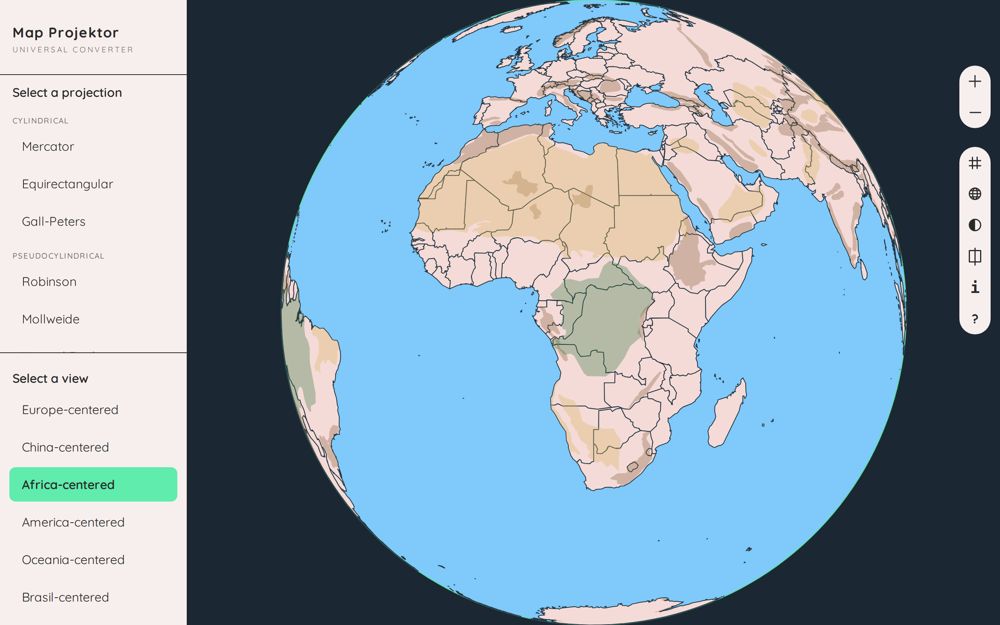
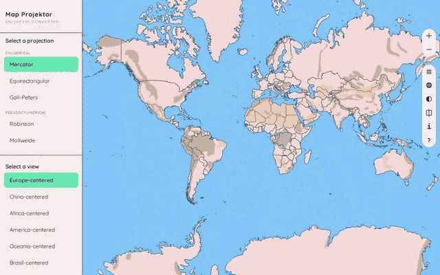
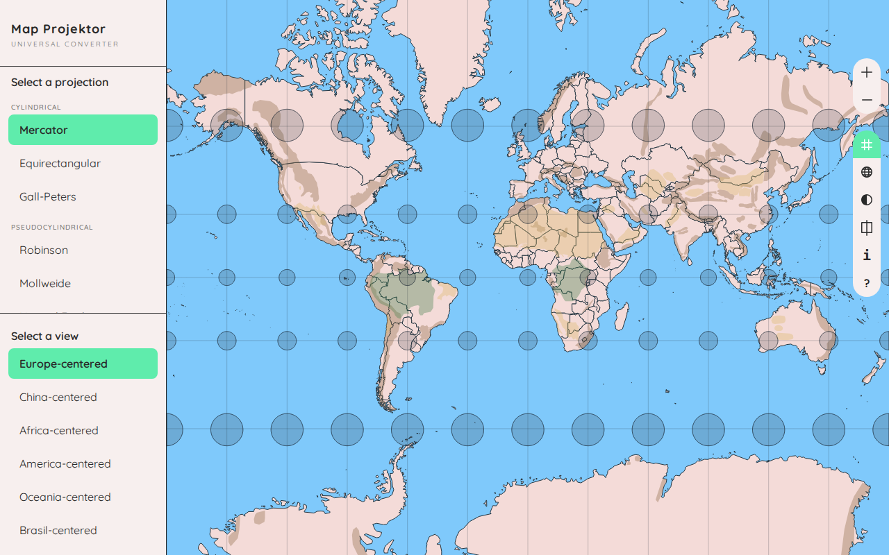
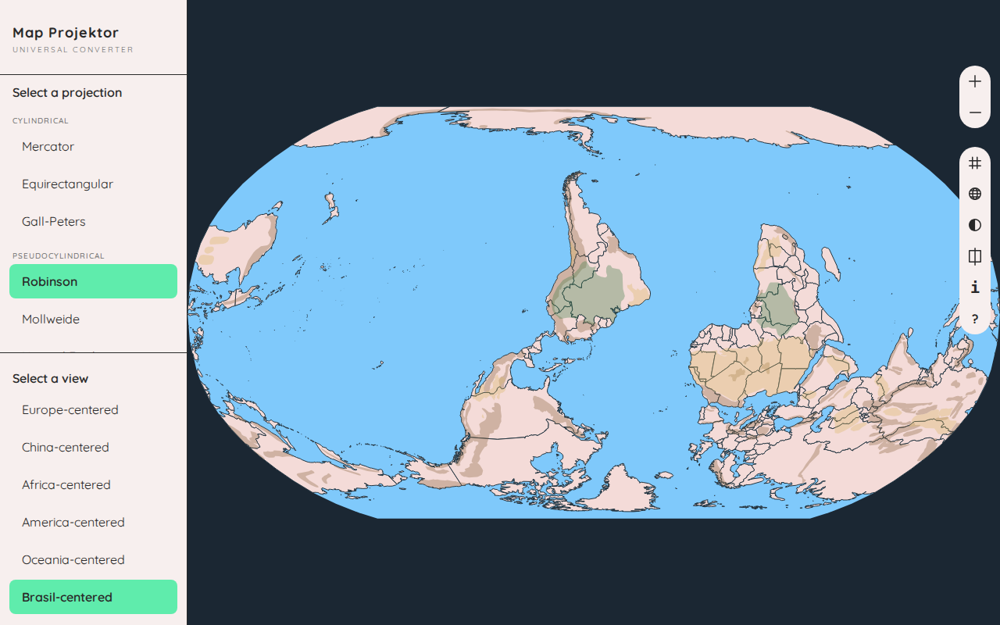
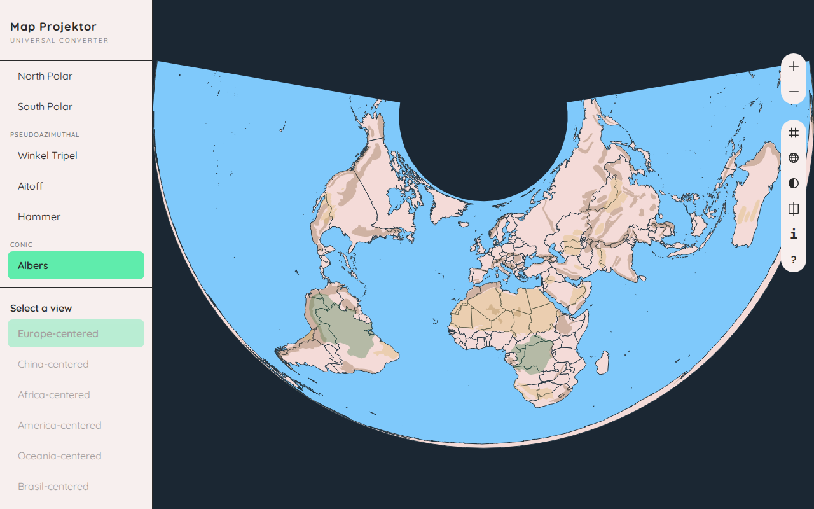
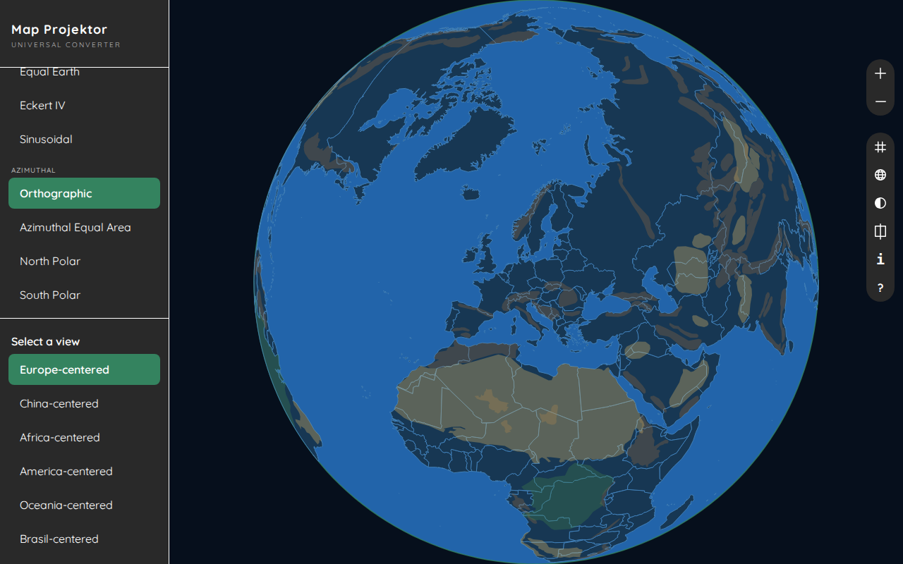

<h1 align="center">Map Projektor</h1>

<p align="center"><strong>The Universal Map Projection Converter</strong></p>

<p align="center">
  An interactive world map that morphs between 17 cartographic projections,<br>
  so you can see what each one preserves and what it distorts.
</p>

<p align="center">
  
</p>

## See it move

Switching projection never snaps: the map morphs from one to the other, and routes through the globe when a polar view is involved.

<p align="center">
  
</p>

| | |
|---|---|
| <br>**Distortion grid** on Mercator | <br>**South-up view** on Robinson |
| <br>**Conic** projection (Albers) | <br>**Dark theme** on the globe |

## Features

- **17 projections in 5 families**: cylindrical, pseudocylindrical, azimuthal, pseudoazimuthal and conic, from Mercator to Equal Earth, plus a draggable 3D globe and two polar views
- **Animated transitions**: the map morphs from one projection to the next instead of snapping; a switch to or from a polar view folds into the globe, spins, then unfolds
- **Six points of view**: Europe-, China-, Africa-, America- and Oceania-centered, and a south-up map. The Europe-centered default is a convention, not a fact of nature, and the chosen view carries over when you switch projection
- **Distortion grid**: Tissot's indicatrix, a grid of identical circles on the sphere that the projection stretches into ellipses, so you see where and how much it distorts
- **Reference lines**: equator, tropics, polar circles and meridians
- **Country size comparison**: pick up to 5 countries and redraw them under another projection, on top of the current map
- **Projection facts**: what each projection preserves, what it distorts and what it is best for
- **Navigation**: zoom with the buttons or the mouse wheel, drag to pan or to spin the globe, click a country to focus on it
- **Light and dark themes**, remembered between visits
- **Guided tour** on the first visit, replayable from the toolbar
- **Mobile layout**: the sidebar becomes a drawer on small screens

## Quickstart

You need Python 3.10+ and [Poetry](https://python-poetry.org/).

```bash
git clone https://github.com/Binardino/map-projektor.git
cd map-projektor
poetry install
poetry run uvicorn app.main:app --reload
```

Open [http://localhost:8000](http://localhost:8000).

The map data is committed, so there is nothing to download first. The browser loads D3 from a CDN, so it needs internet access.

To refresh the data from Natural Earth (optional, needs internet access):

```bash
poetry run python scripts/fetch_geodata.py
```

Run the tests:

```bash
poetry run pytest -v
```

## Run with Docker

No Python or Poetry needed on your machine:

```bash
docker build -t map-projektor .
docker run -p 8000:8000 map-projektor
```

Or with Docker Compose:

```bash
docker compose up --build
```

Open [http://localhost:8000](http://localhost:8000). The container listens on `$PORT` (8000 by default), which is what most hosting platforms expect; [docs/deployment.md](docs/deployment.md) walks through one of them.

## Stack

| Layer | Technology |
|---|---|
| Server | FastAPI + uvicorn, Jinja2 template |
| Map | D3.js v7 + d3-geo-projection v4, drawn as SVG |
| Frontend code | Plain ES modules: no framework, no bundler, no npm |
| Data pipeline | Python (`requests` + `shapely`) on Natural Earth 1:50m data |
| Checks | pytest, Node's built-in test runner, Playwright |
| Packaging | Poetry, Docker |

<!-- SEC_CONTRIBUTING -->

<!-- SEC_CREDITS_LICENSE -->
